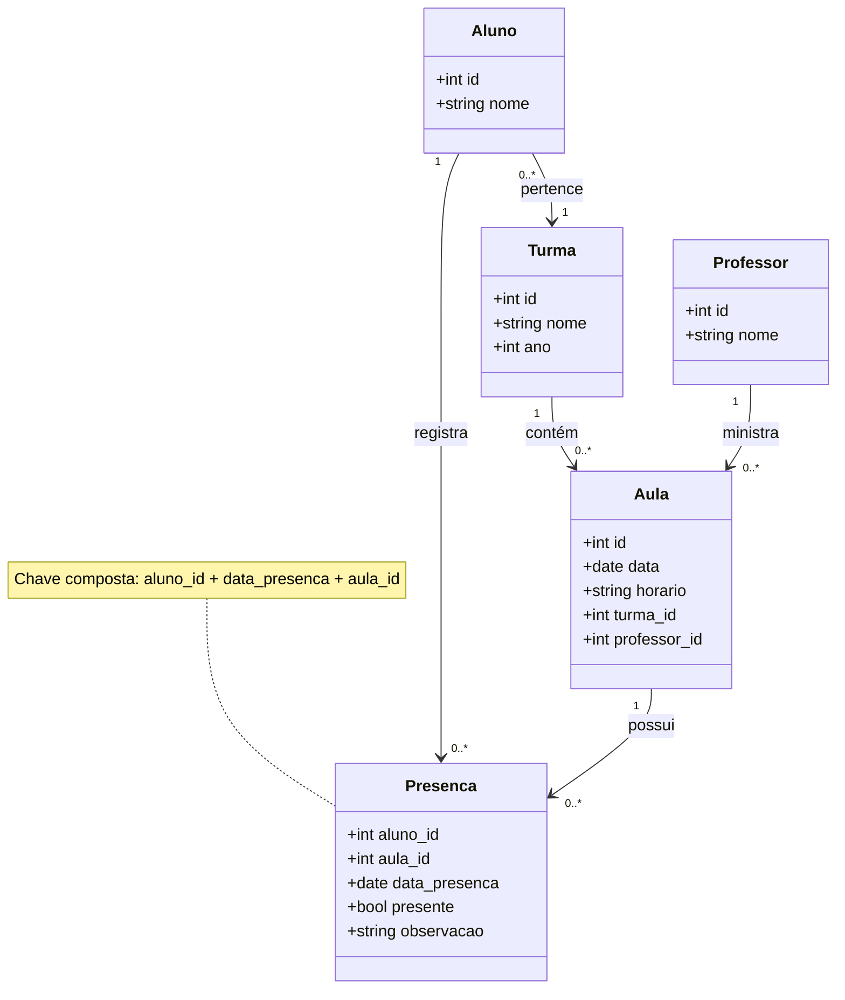

# Passo a passo

# [Novidades do Django 5.2](https://docs.djangoproject.com/en/5.2/releases/5.2)

Temos aqui algumas notas complementares do tutorial.

## School models

Considere a modelagem para alunos, aulas e lista de presença.



Em `school/models.py` temos:

```python
from django.db import models
from django.urls import reverse_lazy


class ClassGroup(models.Model):
    name = models.CharField(
        max_length=100,
        verbose_name="nome da turma"
    )
    year = models.PositiveIntegerField(
        verbose_name="ano"
    )

    class Meta:
        verbose_name = "turma"
        verbose_name_plural = "turmas"

    def __str__(self):
        return f"{self.name} ({self.year})"


class Student(models.Model):
    name = models.CharField(
        max_length=100,
        verbose_name="nome do aluno"
    )
    class_group = models.ForeignKey(
        ClassGroup,
        on_delete=models.CASCADE,
        verbose_name="turma",
        related_name='students',
    )
    color = models.CharField('cor', max_length=7, null=True, blank=True)
    phone = models.CharField('telefone', max_length=19, null=True, blank=True)

    class Meta:
        verbose_name = "aluno"
        verbose_name_plural = "alunos"

    def __str__(self):
        return self.name

    def get_absolute_url(self):
        return reverse_lazy('school:student_list')


class Teacher(models.Model):
    name = models.CharField(
        max_length=100,
        verbose_name="nome do professor"
    )

    class Meta:
        verbose_name = "professor"
        verbose_name_plural = "professores"

    def __str__(self):
        return self.name


class Lesson(models.Model):
    date = models.DateField(
        verbose_name="data"
    )
    time = models.CharField(
        max_length=20,
        verbose_name="horário"
    )
    class_group = models.ForeignKey(
        ClassGroup,
        on_delete=models.CASCADE,
        related_name='lessons',
        verbose_name="turma"
    )
    teacher = models.ForeignKey(
        Teacher,
        on_delete=models.CASCADE,
        related_name='lessons',
        verbose_name="professor"
    )

    class Meta:
        verbose_name = "aula"
        verbose_name_plural = "aulas"

    def __str__(self):
        return f"Aula em {self.date} às {self.time} - {self.class_group.name}"


class Attendance(models.Model):
    pk = models.CompositePrimaryKey('student', 'date_attendance', 'lesson')
    date_attendance = models.DateField(auto_now_add=True, help_text='data da presença')
    student = models.ForeignKey(
        Student,
        on_delete=models.CASCADE,
        related_name='attendances',
        verbose_name="aluno"
    )
    lesson = models.ForeignKey(
        Lesson,
        on_delete=models.CASCADE,
        related_name='attendances',
        verbose_name="aula"
    )
    present = models.BooleanField(
        default=False,
        verbose_name="presente"
    )
    note = models.TextField(
        blank=True,
        verbose_name="observação"
    )

    class Meta:
        verbose_name = "presença"
        verbose_name_plural = "presenças"

    def __str__(self):
        return f"{self.student.name} - {self.lesson} ({'Presente' if self.present else 'Faltou'})"

    def to_dict(self):
        return {
            'pk': self.pk,
            'display': f"{self.student.name} - {self.date_attendance} - {self.lesson.id}",
            'date_attendance': self.date_attendance,
            'student': self.student,
            'lesson': self.lesson,
            'present': self.present,
            'note': self.note,
        }
```

### Rodando a lista de presença no shell

```bash
python manage.py shell -v 2
```

```python
import random
from datetime import date, timedelta
```

#### 1. Criar algumas turmas

```python
turma1 = ClassGroup.objects.create(name="5º Ano A", year=2025)
turma2 = ClassGroup.objects.create(name="5º Ano B", year=2025)
```

#### 2. Criar professores

```python
prof1 = Teacher.objects.create(name="Regis")
prof2 = Teacher.objects.create(name="Maria Oliveira")
```

#### 3. Criar alunos para as turmas

```python
alunos_turma1 = [
    Student.objects.create(name=name, class_group=turma1)
    for name in [
        "Emma Johnson",
        "Liam Smith",
        "Olivia Williams",
        "Noah Brown",
        "Ava Jones"
    ]
]

alunos_turma2 = [
    Student.objects.create(name=name, class_group=turma2)
    for name in [
        "Elijah Miller",
        "Sophia Davis",
        "James Garcia",
        "Isabella Martinez",
        "Benjamin Wilson"
    ]
]
```

#### 4. Criar aulas para as turmas

```python
today = date.today()

aulas_turma1 = [
    Lesson.objects.create(
        date=today + timedelta(days=i),
        time="08:00",
        class_group=turma1,
        teacher=prof1
    )
    for i in range(3)
]

aulas_turma2 = [
    Lesson.objects.create(
        date=today + timedelta(days=i),
        time="10:00",
        class_group=turma2,
        teacher=prof2
    )
    for i in range(3)
]
```

#### 5. Criar as presenças aleatórias

```python
for aula in aulas_turma1:
    for aluno in alunos_turma1:
        Attendance.objects.create(
            student=aluno,
            lesson=aula,
            present=random.choice([True, False]),
            note=""
        )

for aula in aulas_turma2:
    for aluno in alunos_turma2:
        Attendance.objects.create(
            student=aluno,
            lesson=aula,
            present=random.choice([True, False]),
            note=""
        )
```

#### Verificando os dados

```python
from rich import print
from rich.console import Console
from rich.table import Table

from core.models import Attendance

console = Console()

attendances = Attendance.objects.select_related("student", "lesson")

# Tabela com resumo
table = Table(title="Registro de Presenças")

table.add_column("Aluno", style="cyan", no_wrap=True)
table.add_column("Data da Aula", style="green")
table.add_column("Hora", style="yellow")
table.add_column("Turma", style="magenta")
table.add_column("Presença", style="bold")

for a in attendances:
    table.add_row(
        f"{a.student.id}. {a.student.name}",
        a.lesson.date.strftime("%d/%m/%Y"),
        a.lesson.time,
        a.lesson.class_group.name,
        "✅ Presente" if a.present else "❌ Faltou"
    )

console.print(table)
```

#### Ou

```python
from rich.pretty import pprint

for a in attendances:
    pprint(a.to_dict())
    print()
```

#### Vamos tentar criar uma nova presença para um aluno que já tem presença.

```python
aluno1 = Student.objects.first()
aula1 = Lesson.objects.first()
Attendance.objects.create(student=aluno1, lesson=aula1, present=True)

```

## Forms

```python
# forms.py
from django import forms

from apps.school.models import Student


class StudentForm(forms.ModelForm):

    class Meta:
        model = Student
        fields = ('name', 'class_group', 'color', 'phone')
        widgets = {
            'color': forms.ColorInput(),
            'phone': forms.TelInput(),
        }


class SearchForm(forms.Form):
    search = forms.CharField(
        required=False,
        widget=forms.SearchInput()
    )
```

E em `views.py` temos:

```python
# views.py
from django.views.generic import CreateView, ListView

from .forms import SearchForm, StudentForm
from .models import Student


class StudentListView(ListView):
    model = Student

    def get_queryset(self):
        queryset = super().get_queryset()
        self.form = SearchForm(self.request.GET)

        if self.form.is_valid():
            search = self.form.cleaned_data.get('search')
            if search:
                queryset = queryset.filter(name__icontains=search)

        return queryset

    def get_context_data(self, **kwargs):
        context = super().get_context_data(**kwargs)
        context['form'] = self.form
        return context


class StudentCreateView(CreateView):
    model = Student
    form_class = StudentForm
```

### Criando um template_tags

```bash
python manage.py create_template_tags core -n msgbox_tags
python manage.py create_template_tags core -n card_tags
```

